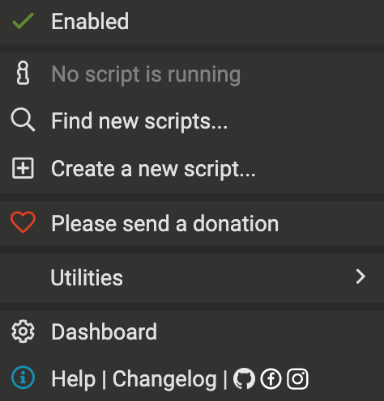
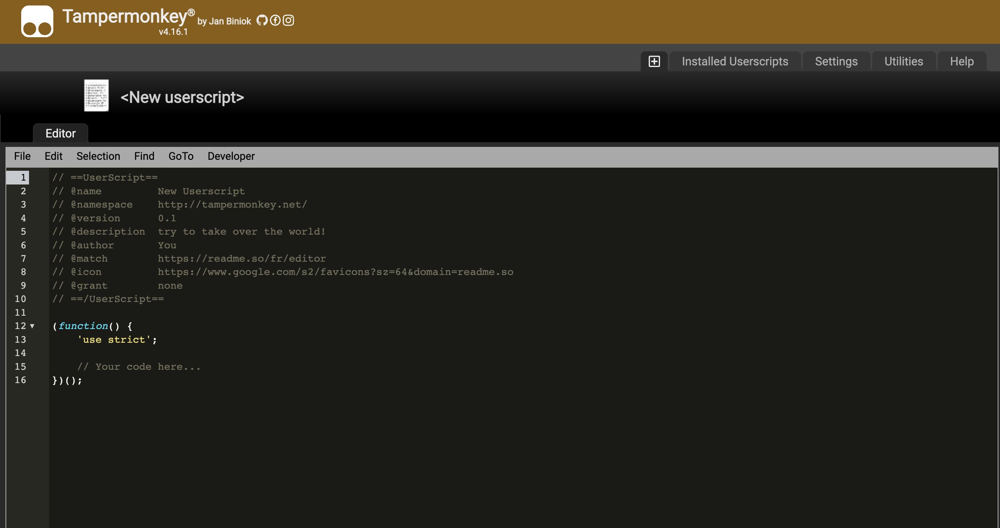
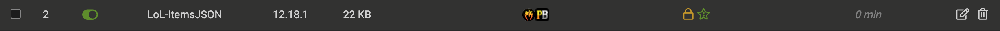
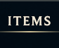
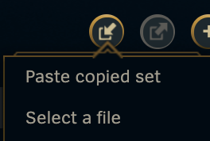

# Mobafire to LOL Item List

This program converts [Mobafire](https://www.mobafire.com/league-of-legends/browse)'s guide lists to a JSON copiable text to paste in League's item set page

## Features

- Able to fully convert item sets from Mobafire's Guides and make them available for you in-game

- Lightweight, and fast execution

## Requirements

To be able to use this tool, you need:

- A Script Manager/Injectors extension installed, like [TamperMonkey](https://chrome.google.com/webstore/detail/tampermonkey/dhdgffkkebhmkfjojejmpbldmpobfkfo) *or equivalents like Greasemonkey, Violentmonkey and Userscripts*

- The [userscript.js](https://github.com/aougri/Mobafire-to-LOL-Item-List/blob/main/userscript.js), we will copy it's contents to use with one of the mentioned softwares, all the examples will be in TamperMonkey. 

- League of Legends client opened in the Main > Collections > Items page
## Installation

- Go directly in my repo to the [userscript.js](https://github.com/aougri/Mobafire-to-LOL-Item-List/blob/main/userscript.js) file, and copy it entirely, to be sure that you copied it, use the ***Github copy button***

- After you get Tampermonkey extension installed, get it pinned, and click on it, a menu like this will appear:

- Click on *Create new script*, it will get you to a new page like this:

- Now delete all contents of that default page, and paste the contents of the [userscript.js](https://github.com/aougri/Mobafire-to-LOL-Item-List/blob/main/userscript.js) instead there.

- Now click on File > Save and you should get a screen like this: 

If you see it like this, then **Congrats**, you have it now locked and loaded, let's see how to use it now.
## Usage

Now that you got it installed, time to use it.

*Note: As of now (10th Oct, 2022), i still haven't fixed the probuilds bugs, and it's still non functional, will fix them in the near future*

***Webpage part***

- Go to [Mobafire's Guides page](https://www.mobafire.com/league-of-legends/browse), as a Tryndamere main, I will select a guide for the demo, but it's usable with every champion!

- After you have selected your guide, go for it and wait for the page to load, to see if there was anything done there are two indicators:

I - The Tampermonkey logo will have a 1 sign on it, so that means that the script was successfully injected.

II- A red button will appear in the upper right part of the page. 

- Press on it to see some weird magic text appear, it contains all the items (**NO RUNES**) visible on the page, the 2nd, 3rd options will not be counted. It will be pre-highlighted for you, so just copy it and go to your League client

***League Client part***

Now, you have done the harder work, you have only a bit to go!

- Go to your league client, and go to Collection > Item page:

 

- Press the *Paste a copied set* button:

- A text box will appear, paste what you have copied there and press Enter or wait

- As i chose [this](https://www.mobafire.com/league-of-legends/build/raens-tryndamere-tips-amp-build-569493) excellent Tryn guide, my final screen looks like this:

# Acknowledgements

This was a project started by [EagleExe](https://github.com/EagleExe/LoL-ItemsJSON) 2 years ago, unfortunately the first [issue](https://github.com/EagleExe/LoL-ItemsJSON/issues/2) was made on Nov 16, 2020. Always wanted to fix it, finally got the skill to do so!

And i will try to keep it up as much as I can, aswell as update it as new patches come, so don't hesitate to make an issue [here](https://github.com/aougri/Mobafire-to-LOL-Item-List/issues) in case i ever slack on new updates!

## Author

- [@EagleExe](https://github.com/EagleExe)

## Maintainer

- [@aougri](https://www.github.com/aougri)

## API Reference

- [League latest items API by ddragon](https://ddragon.leagueoflegends.com/cdn/12.18.1/data/en_US/item.json)

- [League latest Champions API by ddragon](https://ddragon.leagueoflegends.com/cdn/12.18.1/data/en_US/champion.json)